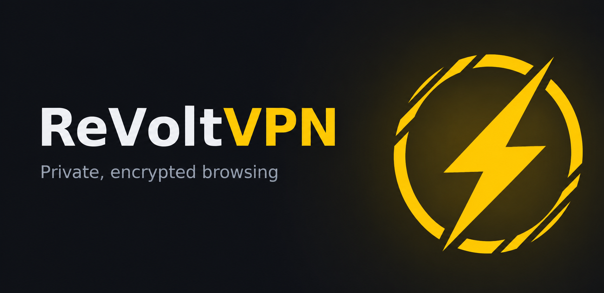
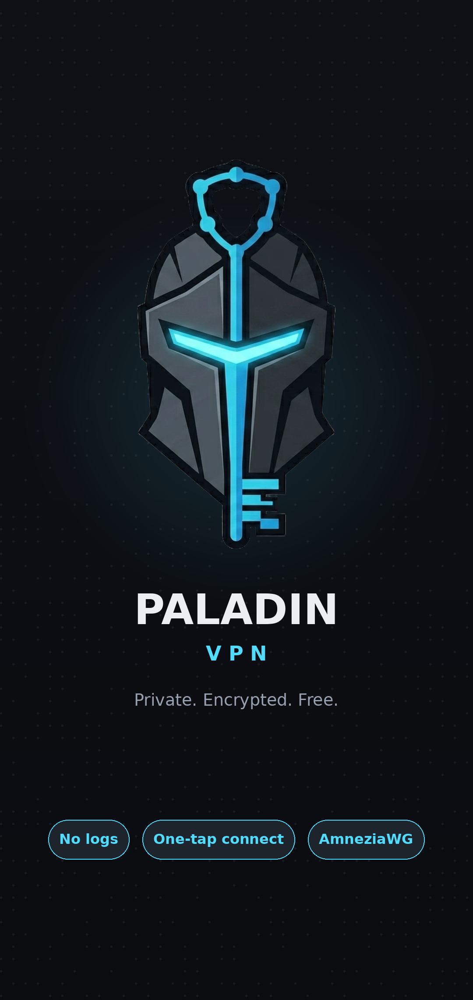
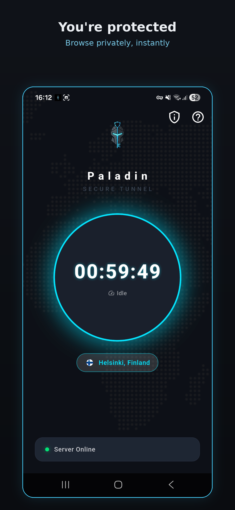

---

  

# ReVoltVPN
A free VPN app built from scratch. I handle the Flutter app, Hivemind backend, and AdMob integration — the ReVolt team manages server security and VLESS/Xray infrastructure.

  
  &nbsp;&nbsp;&nbsp;
  

There are hundreds of free VPN apps on the Play Store. Most of them are fine honestly — some are genuinely good. But a lot of them are vague about how they work, who runs them, and what happens to your traffic. I wanted to build something where the answer to all of those questions is just... public.

So here it is.

---

## How it works
You watch a short ad. You get 60 minutes and 4 GB of full-speed traffic. That's it. The ad pays for the server (actually not even enough). No accounts, no emails, no subscriptions.

When your data runs out you get throttled to 1.5 Mbps instead of getting cut off. A second Reality inbound on a different port handles throttled traffic — your client reconnects automatically, no ad required.

---

## The stack
- **App** — Flutter (Android only for now)
- **Server** — A single Debian box rented from Hetzner, located in Finland
- **VPN protocol** — VLESS + Xray Reality (XTLS-Vision). Spoofs real TLS certificates (e.g. www.microsoft.com) so your tunnel looks like regular HTTPS. Great for bypassing DPI in countries that are aggressive with it.
- **Backend** — Hivemind, a Python Flask server I wrote that manages sessions, data quotas, throttling, and live swarm monitoring. Entire server is open source — in this repo.
- **Ads** — Google AdMob rewarded ads, verified server-side so fake callbacks don't work

---

## Limitations (being honest)
- One server, one location (Finland). That's all I can afford right now (planning to escalate further)
- 2 cores and 4GB RAM. It will not handle thousands of concurrent users
- iOS is not supported and probably won't be for a while
- The app is built by me in my free time — expect rough edges

---

## Why I built this
Free time project. I wanted to learn how VPNs actually work under the hood. Ended up building the whole thing from scratch — the Flutter app, Hivemind backend, and AdMob integration are made by me, while server security and VLESS/Xray setup are handled by the ReVolt team. It took way longer than expected.

---

## Privacy
Your traffic goes through my server in Finland. I don't log it, I don't sell it, I have no reason to. The session manager (Hivemind) only tracks whether your session is active and how much data you've used — nothing else.

Internet privacy at the cost of watching an ad. Honest business.

You can read the server code yourself, it's in this repo.

---

*ReVoltVPN is not affiliated with any VPN company.*

---
